# GitOps Workshop Guide for **MQ on CP4I**

## Overview  

<!--- cSpell:ignore gitorg YAMLs -->

The GitOps concept originated from [Weaveworks](https://www.weave.works/) back in 2017 and the goal was to automate the operations of a Kubernetes (K8s) system using a model external to the system as the source of truth ([History of GitOps](https://www.weave.works/blog/the-history-of-gitops)).

There are various GitOps structure and workflows.  This workshop will cover our opinionated point of view (PoV) on how `GitOps` can be used to manage the infrastructure, services and application layers of K8s based systems.  It takes into account the various personas interacting with the system and accounts for separation of duties.

On the first day of the workshop, we will give you an overview of IBM's GitOps structure and workflow. This workshop guide is meant to be a companion for the 2nd and 3rd day of the workshop, where you will get hands-on experience of deploying CP4I and MQ using our GitOps workflow. There are 4 parts to this workshop guide: 
-   Shell Environment Setup - Shell env needs to be setup before starting each lab
-   Pre-Lab 1 - Create your github personal access token, which you'll be using to push to your GitOps repos
-   Lab 1 - Deploy CP4I using our GitOps process
-   Lab 2 - Validate use case requirements: Self-Healing, Upgrade/Rollback and Horizontal Pod Auto-Scaling.

## Shell Environment Setup 
You will be provided with a spreadsheet which will contain links to your assigned environments, and your associated ids. Before you start this section of the workshop, you will need to verify that you can access your assigned Openshift cluster on IBM Cloud using your IBMid. You will also need to verify that you have been added to a Public GitHub Organisation by the IBM team.

1. Login to your IBM Cloud account and access the [IBM Cloud Shell](https://cloud.ibm.com/shell)

*Note that the shell session's [IBM Cloud Shell workspace](https://cloud.ibm.com/docs/cloud-shell?topic=cloud-shell-files#file-persistence) is deleted one hour after the shell session is closed.  If you lose the shell workspace, you will need to re-setup the environment.*

2. Install and setup the prequiste CLIs 
```bash
mkdir bin
cd bin
wget https://github.com/bitnami-labs/sealed-secrets/releases/download/v0.17.4/kubeseal-0.17.4-linux-amd64.tar.gz
tar -xvf kubeseal-0.17.4-linux-amd64.tar.gz
chmod 755 kubeseal
export PATH=~/bin:$PATH
echo $PATH
```

3. Setup the environement variables
```bash
# Your-Github-Org should be the name of the github org that was created for this Lab
export GIT_ORG=Your-Github-Org
```
```bash
#Validate that GIT_ORG has the correct value.
echo $GIT_ORG 
```
4. Clone your GitOps repositories from your Github Organization 
```bash
cd ~
mkdir $GIT_ORG
cd $GIT_ORG
git clone https://github.com/$GIT_ORG/multi-tenancy-gitops.git
git clone https://github.com/$GIT_ORG/multi-tenancy-gitops-infra.git
git clone https://github.com/$GIT_ORG/multi-tenancy-gitops-services.git
ls -l
```

5. Setup your GitHub profile
```bash
# Your e-mail should be the e-mail you used to sign up for github
git config --global user.email "Your e-mail"
```
```bash
# Your Name should be the name you used to sign up for github
git config --global user.name "Your Name"
```

6. Switch to your assigned Openshift cluster on IBM cloud.

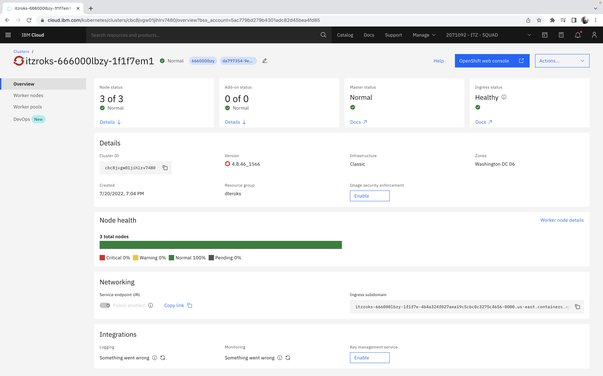

Launch the **OpenShift Web Console**. From the dropdown menu on the upper right corner of the OpenShift web console, select `Copy login command`. 

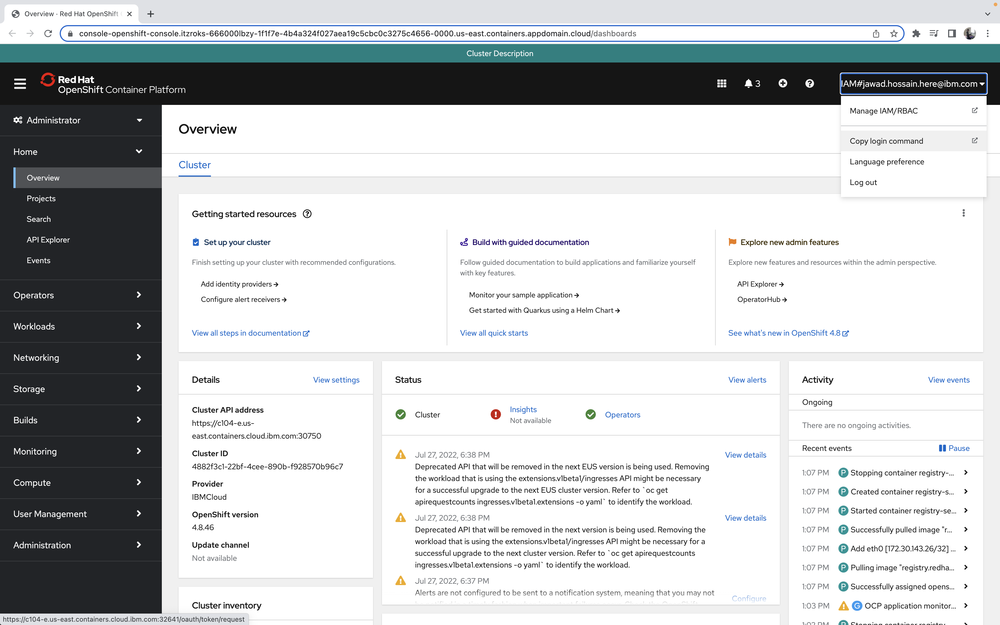

You should be redirected to a nearly blank page containing a link that says `Display Token`.

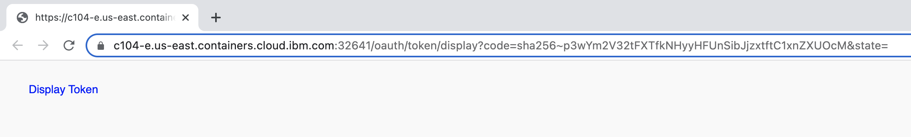

Once you click on `Display Token`, you will be able to see your OpenShift API token as well as the login command for logging into your Openshift cluster on the shell. Copy and paste the line that starts with `oc login` in your IBM Cloud shell.


7. Check the spreadsheet provided prior to this workshop for the link to your assigned Argo CD instance. The spreadsheet should also contain the credentials needed for you to login to the ArgoCD instance as admin. Once you have logged in, verify that you have the `infra` and `services` Argo CD applications:

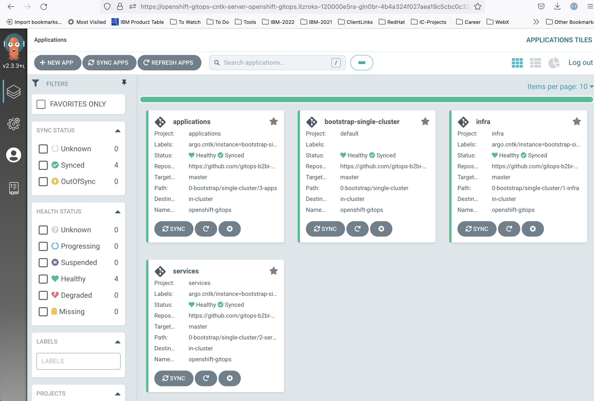
 
---

### Pre-Lab 1 - Create a GitHub Personal Access Token

1. Log in to the public GitHub account which you are using for this workshop

2. Click on your GitHub avatar located at the top right corner of the page and select `Settings` from the dropdown

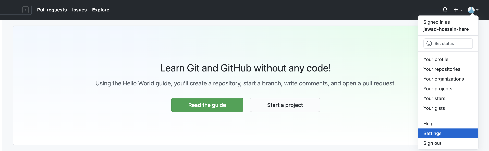

3. Check the left sidebar, and scroll down until you see **Developer settings**

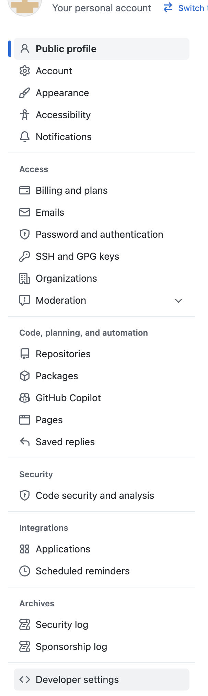

4. Once you have clicked on **Developer settings**, you will see a new left sidebar where you need to select **Personal access tokens**. You will then see a button you can click to `Generate new token`

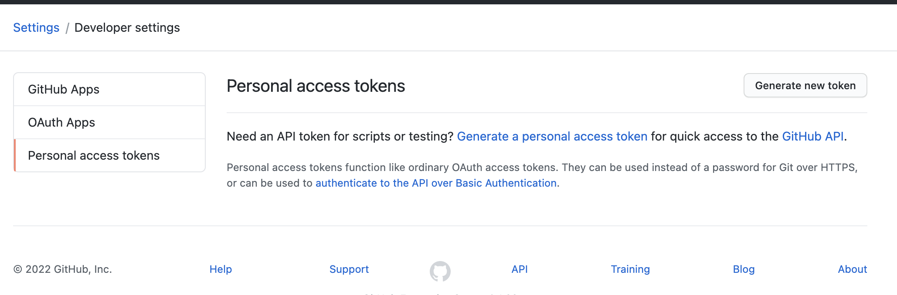

5. Enter a name for your new personal access token and set a suitable `Expiration`. Ensure the **repo** scope is checked before you click **Generate Token** at the bottom of the page

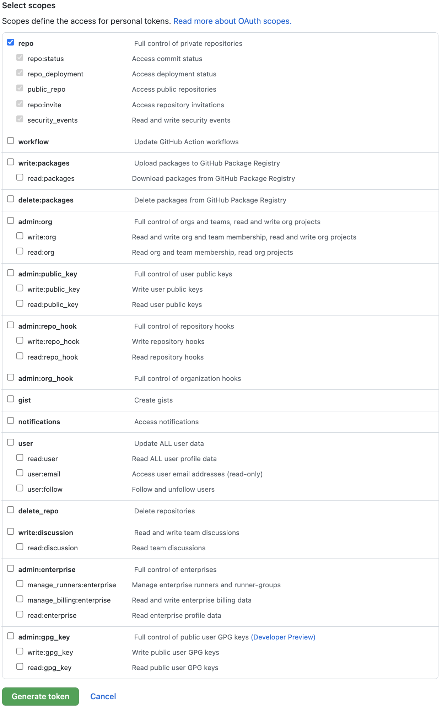

6. The token is displayed only once so, make sure you copy it. You will need it multiple times during the next parts of the workshop.

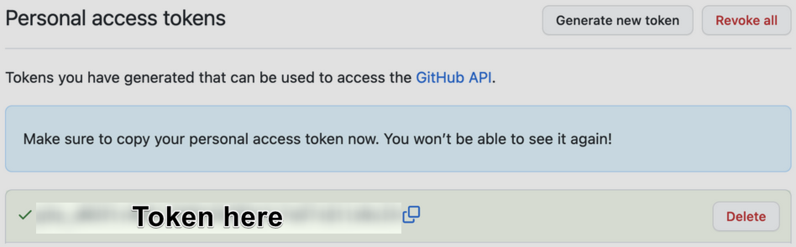

---

# Lab 1: Deploy Cloud Pak for Integration - MQ capability

### 1. Infrastructure - Kustomization.yaml
On your IBM Cloud Shell, open the kustomization.yaml file for the infra layer as follows:
```bash
vi ~/$GIT_ORG/multi-tenancy-gitops/0-bootstrap/single-cluster/1-infra/kustomization.yaml
```

You'll need to un-comment some of the k8s resources under the 'resources' field in the `kustomization.yaml` file in order to deploy the kubernetes infrastructure level resources required for MQ on CP4I. The resources you'll need to uncomment are shown below:

```yaml
resources:
#- argocd/consolelink.yaml
- argocd/consolenotification.yaml
- argocd/namespace-ibm-common-services.yaml
- argocd/namespace-ci.yaml
- argocd/namespace-dev.yaml
- argocd/namespace-staging.yaml
- argocd/namespace-prod.yaml
#- argocd/namespace-cloudpak.yaml
#- argocd/namespace-istio-system.yaml
#- argocd/namespace-openldap.yaml
- argocd/namespace-sealed-secrets.yaml
- argocd/namespace-tools.yaml
#- argocd/namespace-instana-agent.yaml
#- argocd/namespace-robot-shop.yaml
#- argocd/namespace-openshift-serverless.yaml
#- argocd/namespace-knative-eventing.yaml
#- argocd/namespace-knative-serving.yaml
#- argocd/namespace-knative-serving-ingress.yaml
#- argocd/namespace-openshift-storage.yaml
#- argocd/namespace-spp.yaml
#- argocd/namespace-spp-velero.yaml
#- argocd/namespace-baas.yaml
#- argocd/namespace-db2.yaml
#- argocd/namespace-mq.yaml
#- argocd/namespace-b2bi-prod.yaml
#- argocd/namespace-b2bi-nonprod.yaml
#- argocd/namespace-pem.yaml
#- argocd/serviceaccounts-ibm-common-services.yaml
#- argocd/serviceaccounts-tools.yaml
#- argocd/serviceaccounts-db2.yaml
#- argocd/serviceaccounts-mq.yaml
#- argocd/serviceaccounts-b2bi-prod.yaml
#- argocd/serviceaccounts-b2bi-nonprod.yaml
#- argocd/serviceaccounts-pem.yaml
#- argocd/sfg-b2bi-clusterwide.yaml
#- argocd/pem-b2bi-clusterwide.yaml
#- argocd/scc-wkc-iis.yaml
#- argocd/norootsquash.yaml
#- argocd/daemonset-sync-global-pullsecret.yaml
#- argocd/storage.yaml
#- argocd/infraconfig.yaml
#- argocd/machinesets.yaml
```

Now deploy these changes by committing and pushing the changes to your `multi-tenancy-gitops` repository
```bash
#change to the `multi-tenancy-gitops` directory
cd ~/$GIT_ORG/multi-tenancy-gitops

# Verify the changes, and add the files that have been changed
git status
git add -u
 
# Finally commit and push the changes
git commit -m "Deploy infrastructure resources"
git push
# Input your Github username when prompted for Username
# Input the Github Token that you had created earlier when prompted for Password
```

Switch to your Argo CD instance, and click on the **infra** application. Click on **REFRESH** located in the top middle of the page. Argo CD will then see the changes you made and automatically propagate the changes to OpenShift. After the **infra** application has finished sync-ing, it should look as follows:


### 2. Services - Kustomization.yaml
2.1 [Optional] You may edit the Platform Navigator instance yaml and specify a different storage class that supports ReadWriteMany(RWX).
On your IBM Cloud Shell, open the yaml file as follows:
```bash
vi ~/$GIT_ORG/multi-tenancy-gitops/0-bootstrap/single-cluster/2-services/argocd/instances/ibm-platform-navigator-instance.yaml
```
The default is set to `managed-nfs-storage`. You may change its as follows:
```yaml
....
spec:
  ....
  source:
    path: instances/ibm-platform-navigator-instance
    helm:
      values: |
        ibm-platform-navigator-instance:
          ibmplatformnavigator:
            name: integration-navigator
            spec:
              ....
              storage:
                class: managed-nfs-storage     <----change to your desired storage class 
```

2.2  Deploy Services Layer resources.
On your IBM Cloud Shell, open the kustomization.yaml file for the services layer as follows:
```bash
vi ~/$GIT_ORG/multi-tenancy-gitops/0-bootstrap/single-cluster/2-services/kustomization.yaml
```

You'll need to un-comment some of the k8s resources under the 'resources' field in the `kustomization.yaml` file in order to deploy the services layer resources required for MQ on CP4I. The resources you'll need to uncomment are shown below:
```yaml
## Cloud Pak for Integration
#- argocd/operators/ibm-ace-operator.yaml
#- argocd/operators/ibm-apic-operator.yaml
#- argocd/instances/ibm-apic-instance.yaml
#- argocd/instances/ibm-apic-management-portal-instance.yaml
#- argocd/instances/ibm-apic-gateway-analytics-instance.yaml
#- argocd/operators/ibm-aspera-operator.yaml
#- argocd/operators/ibm-assetrepository-operator.yaml
#- argocd/operators/ibm-cp4i-operators.yaml
#- argocd/operators/ibm-datapower-operator.yaml
#- argocd/operators/ibm-eventstreams-operator.yaml
#- argocd/instances/ibm-eventstreams-instance.yaml
- argocd/operators/ibm-mq-operator.yaml
#- argocd/operators/ibm-opsdashboard-operator.yaml
- argocd/operators/ibm-platform-navigator.yaml
- argocd/instances/ibm-platform-navigator-instance.yaml

## IBM Foundational Services / Common Services
- argocd/operators/ibm-foundations.yaml
- argocd/instances/ibm-foundational-services-instance.yaml
- argocd/operators/ibm-automation-foundation-core-operator.yaml
#- argocd/operators/ibm-automation-foundation-operator.yaml
#- argocd/operators/ibm-license-service-operator.yaml
#- argocd/instances/ibm-license-service-instance.yaml

## IBM Catalogs
- argocd/operators/ibm-catalogs.yaml

# Sealed Secrets
- argocd/instances/sealed-secrets.yaml
```

Now deploy the resources changes by committing and pushing the changes to your `multi-tenancy-gitops` repository
```bash
#change to the `multi-tenancy-gitops` directory
cd ~/$GIT_ORG/multi-tenancy-gitops

# Verify the changes, and add the files that have been changed
git status
git add -u

# Finally commit and push the changes
git commit -m "Deploy services resources"

git push
# Input your Github username when prompted for Username
# Input the Github Token that you had created earlier when prompted for Password
```

Switch to your Argo CD instance, and click on the **services** application. Click on **REFRESH** located in the top middle of the page. Argo CD will then see the changes you made and automatically propagate the changes to OpenShift. After the **services** application has finished sync-ing, it should look as follows:
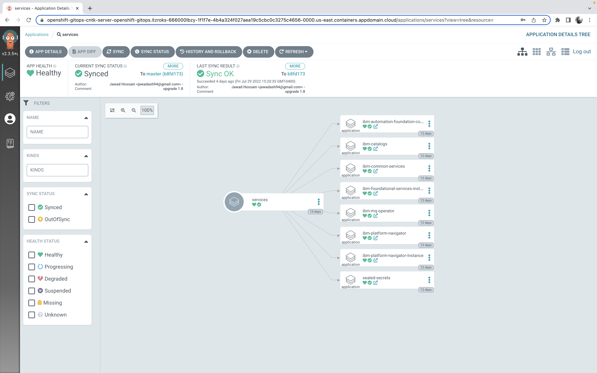

### 3. OpenShift Use Cases
The installation of CP4I can take from 30 min to 1 hour to complete so, while we wait for the installation to finish, we'll walk through some of the use cases, including self-healing and auto-scaling, which doesn't depend on CP4I to be up and running. This part of the workshop can be accessed here https://github.com/ad-jrn/OCP-Workshop-Guide

### 4. Validation
4.1.  Check the status of the `CommonService` and `PlatformNavigator` custom resource
```bash
# Verify the Common Services instance has been deployed successfully
oc get commonservice common-service -n ibm-common-services -o=jsonpath='{.status.phase}'
# Expected output = Succeeded

# [Optional] If selected, verify the Platform Navigator instance has been deployed successfully
oc get platformnavigator -n tools -o=jsonpath='{ .items[*].status.conditions[].status }'
# Expected output = True
```
4.2.  Retrieve Platform Navigator Console URL
```bash
oc get route -n tools integration-navigator-pn -o template --template='https://{{.spec.host}}'
```
Once you have retrieved the URL and entered it in your browser, you will see a login page


    
You may choose to login as admin using IBM Provided Credentials. In order to retrieve these IBM Provided Credentials you can use the following command:
```bash
oc extract -n ibm-common-services secrets/platform-auth-idp-credentials --keys=admin_username,admin_password --to=-
```

## 5. Upgrade/Rollback 

In this section of the lab, we see how you can upgrade and roll back the MQ operator version using the GitOps method.

Using the GitOps method we see how the upgrade process is shortened.  We are also able to roll back to previous version if there is an issue.  The GitOps method also provides for traceability as to when and who made the change in the commit record in GitHub.

First, check the installed operators on your Openshift cluster. You can do this by opening your Openshift web console and selecting the Operators dropdown then Installed Operators on the left sidebar of the web console.

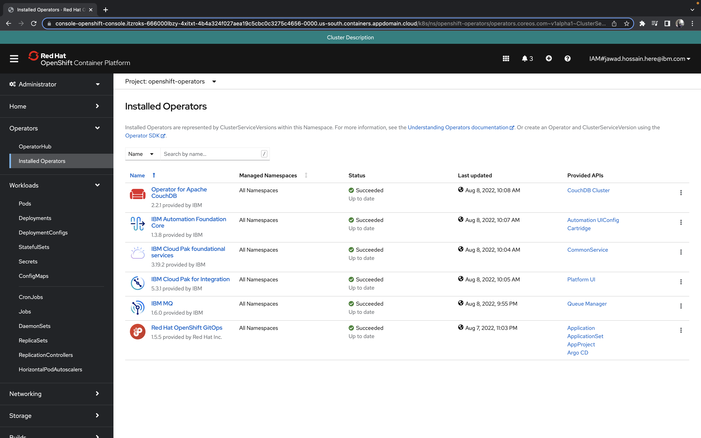

Now, switch to your IBM Cloud Shell, and open the `ibm-mq-operator.yaml` file on your main gitops repo as follows:
```bash
vi ~/$GIT_ORG/multi-tenancy-gitops/0-bootstrap/single-cluster/2-services/argocd/operators/ibm-mq-operator.yaml
```

Inside the `ibm-mq-operator.yaml` file, you can change the MQ operator version as follows
```yaml
....
spec:
  ....
  source:
    path: operators/ibm-mq-operator
    helm:
      values: |
        ibm-mq-operator:
          subscriptions:
            ibmmq:
              name: ibm-mq
              subscription:
                channel: v1.6     <----change to your desired operator version 
```

Now deploy the changes by committing and pushing the changes to your `multi-tenancy-gitops` repository:
```bash
#change to the `multi-tenancy-gitops` directory
cd ~/$GIT_ORG/multi-tenancy-gitops

# Verify the changes, and add the files that have been changed
git status
git add -u
 
# Finally commit and push the changes
git commit -m "upgrade MQ operator version"
git push
# Input your github username when prompted for Username
# Input the Github Token that you had created earlier when prompted for Password
```

Switch to your Argo CD instance, and click on the **services** application. Click on **REFRESH** located in the top middle of the page. Argo CD will then see the changes you made and automatically propagate the changes to OpenShift.
